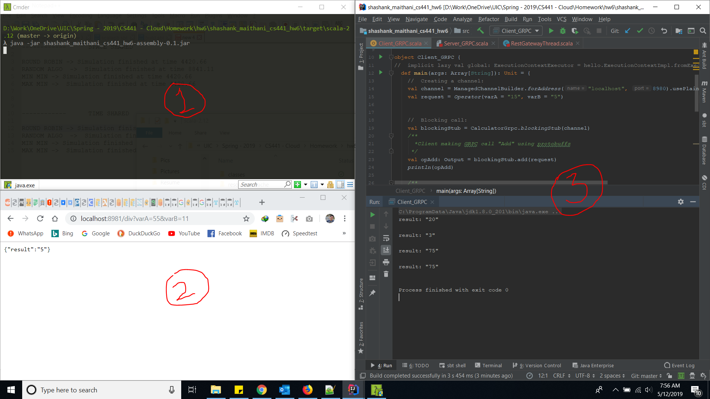

# README #

# Cloud CS441 - Homework 6 #

**Description:**  

  Invoking lamda functions using GRPC and REST.
  
**Explain/Notes:**

    - Added protoc.sbt inside project directory and my lamda.proto file inside "protobuf" directory.
    - created 4 RPC calls for proto (Add, Div, Mul, Sub)
    - ScalaPB compiler compiles the lamda.proto into respective GRPC classes within target\scala-2.12\src_managed\main\lamda
    
    
**Execution:**  
  
   After a long struggle, I was able to run my GRPC over REST via grpcGateway provided by "beyondthelines". 
 
   
  
  
- The compiled jar is within '/jars' folder. The same is being run in the 'FIG-1' which exposes 2 ports:
   
    - Port 8980 for GRPC calls over HTTP2 which cannot be opened via "GET" in browser. This is done in 'FIG-3' via running GRPC client to communicate and get the result of all 4 operations.
    - Port 8981 for GET/POST calls via Browser by bundling HTTP1 over it as shown in 'FIG-2'. This is done by running a separate thread which exposes this port and acts as a gateway for GRPC calls.  

 
 **Deployment on AWS Lamda**
     
     Link:
 
 

 **PS:** 
    
    - HARDEST homework till date. Invested 20+ hours struggling with this project to send protobuffs back/forth.    
    - Half of this time was spent trying dependencies for scalaPB, Proto Compiler, and Gateway.     
    - Was cycling through different versions of SBT as well trying various combinations so that everything could work through 1 version( including compiling, creating proto classes, gateway dependency and assembly)   
    - After much research I found the GRPC gateway over HTTP (from beyondthelines). Thanks to that I can build a Single SBT jar and run it ober HTTP get on browser.
    
 
That's It ! :) 